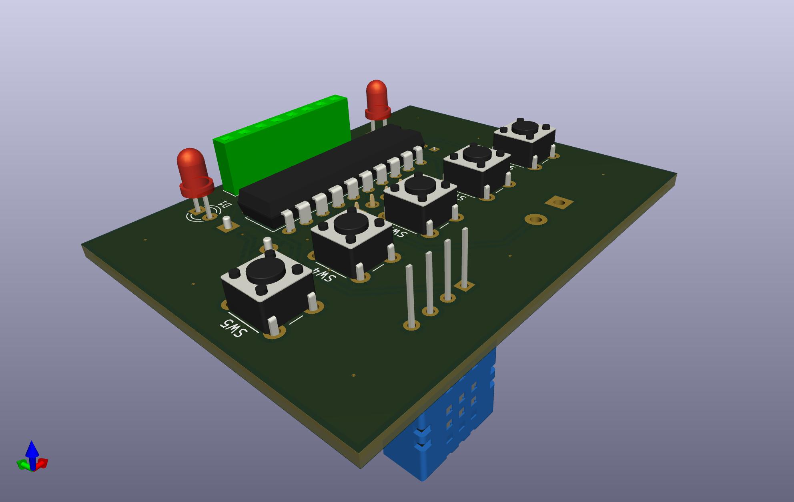

# MSP430G2-Alarm-Clock

## Introduction

## Hardware Requirements

 - MCU: msp430g2553 or similar (with enough memory).
 - External low frequency clock (32768Hz).
 - PCB, proto board, something to build the circuit.
 - Programmer. In my case I'm using the programmer of a launchpad.

Warning: LaunchPads with eZ430-RF2500 will not work with linux or mac, look for launchpads with eZ-FET interface.

### Functions Implemented

 - [X] Clock
 - [X] Date
 - [X] Alarm
 - [X] Control to set clock time and date time.
 - [X] Control to set alarm
 - [X] Battery level monitoring
 - [ ] Humidity and temperature with dht sensor
 - [ ] Auto lcd light on if some button is pushed
 - [ ] Low power mode

## Compiling the Code

There are two principal compiler options:
 * Ti Compiler, included in [CSStudio IDE](https://www.ti.com/tool/CCSTUDIO) (recommended).
 * [GNU Compiler](https://www.ti.com/tool/MSP430-GCC-OPENSOURCE) 

The best way to avoid problems is use CSStudio and Ti compiler. Trying another options can ba a frustrating process.

Anyway, I prefer to generate/update the makefile with CSS and then work with Clion or VSCode.

I've also tried to create a cMake projects, based on [AlexanderSidorenko repo](https://github.com/AlexanderSidorenko/msp-cmake), but with no success by now.

## Flashing the MCU
There are several tools to flash the compiled code into the MSC:
 * Code Composer Studio, which uses internally MSP430Flasher (recommended).
 * [MSP430Flasher](https://www.ti.com/tool/MSP430-FLASHER) cl software and your favourite text editor (more work). A 'upload' make argument can be manually placed inside the CSS generated makefile.
 * [mspdebuger](https://dlbeer.co.nz/mspdebug/). This was my favourite in the past, but I was unable to make in work, maybe mspdebuger is not compatible with current TI compiler.

[More info about upload code using MSP430Flasher here](https://github.com/mafdezmoreno/Testing_MSP430G2)

### Hardware Connections:

Connect the following signals from the debugger to the target MCU.

 * 3.3V
 * GND
 * SBWTDIO
 * SBWTCK

## Schematics and PCB

A Kicad project is included in this repo. This projects include schematics and PCB.

Todo:
 - [X] Review of connections
 - [X] PCB Design
 - [X] Gerber files generation and PCB ordering.

## Other Comments and Problems Working With MSP430

The real time operations can be affected for encapsulation and compiler configuration and introduce in the compiled code unexpected delays. The solution can involve simplify the code (reduce encapsulation to make it "easier" to the compiler) and/or tune the compiler settings.

# Useful resources

 - [MSP430F2xx, MSP430G2xx Family User’s Guide](https://www.ti.com/lit/ug/slau144k/slau144k.pdf?ts=1694900974657&ref_url=https%253A%252F%252Fwww.ti.com%252Fproduct%252FMSP430F2418)
 - [MSP Flasher User’s Guide](https://www.ti.com/lit/ug/slau654e/slau654e.pdf?ts=1694985823973&ref_url=https%253A%252F%252Fwww.google.com%252F)
 - [MSP430 Optimizing C/C++ Compiler v21.6.0.LTS](https://www.ti.com/lit/ug/slau132y/slau132y.pdf?ts=1695037938667)
 - [MSP430G2x53 datasheet](https://www.ti.com/lit/ds/symlink/msp430g2553.pdf?ts=1695283635994&ref_url=https%253A%252F%252Fwww.ti.com%252Fproduct%252FMSP430G2553)